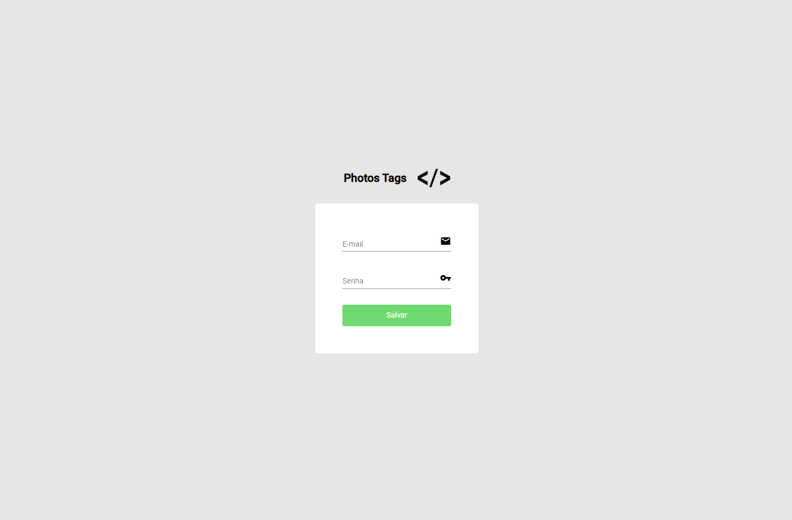
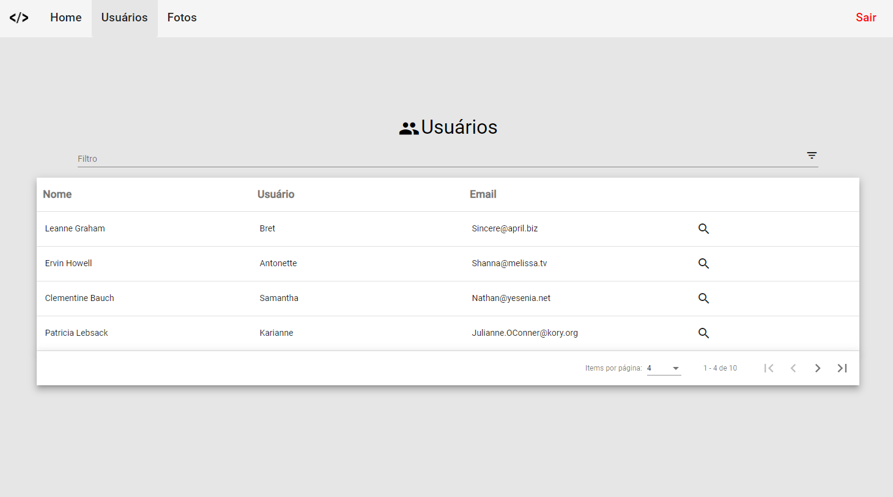
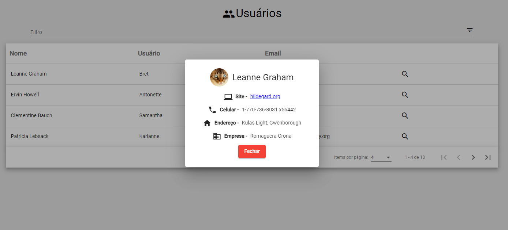
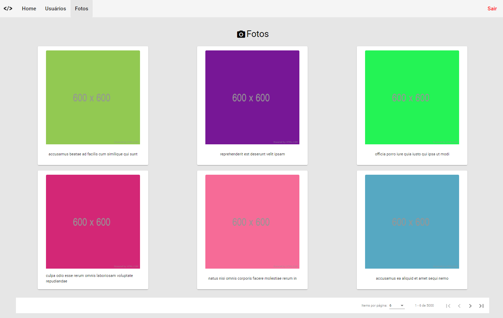

<p align="center">

</p>
<h1 align="center">PHOTOS TAGS</h1>
<h4 align="center">Projeto feito em Angular, no qual tem como objetivo consumir API's de dados randómicos (usuários e imagens) e mostra-los em tela. Desenvolvido no programa Start, da GFT Brasil</h4>

# 🤔 O que é o programa Start?

Criado pela GFT, o Programa START foi concebido com o objetivo de formar e desenvolver jovens profissionais segundo os valores e competências da GFT. Durante o estágio, os STARTERS, como nossos estagiários são chamados, irão passar por diferentes etapas, de forma a se tornar um profissional preparado a enfrentar os mais diversos desafios.

# 🖥 Prints









# 🚀 Executando o projeto

##### 📢  Caso não tenha, é preciso instalar a CLI do Angular, para isso, basta acessar o site **[https://cli.angular.io/](https://cli.angular.io/)** e seguir as instruções lá.

```bash
# Entre na pasta do projeto:
$ cd PhotosTags/

# Digite o comando a seguir, para restaurar as dependências:
$ npm install

# Logo após a instalação das dependências, digite o comando:
$ npm start

# O site inciará na porta:4200 - acesse <http://localhost:4200/>
```

## ⚙ Para acessar

Para ter acesso ao site, você deverá usar o seguinte login:

- ✉ admin@gmail.com  🔑 12345 

# 💡 Tecnologias

Esse projeto foi desenvolvido com as seguintes tecnologias:

- [Angular 11.0](https://angular.io/)
- [NPM](https://www.npmjs.com/)
- [Typescript](https://www.typescriptlang.org/)
- [CSS3](https://www.w3schools.com/css/)
- [HTML5](https://www.w3schools.com/html/)

<hr>

